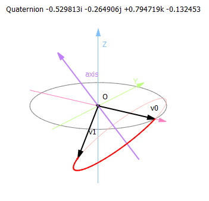

# splot
Go package splot can generate gnuplot files that contains simple 3D points and lines.

这个Go语言包可以用来生成包含简单的3D点和线的gnuplot图表文件. 

# example

see [./toy80-splot-example](./toy80-splot-example/toy80-splot-example.go)

the gnuplot file generated by the example:

[./toy80-splot-example/quaternion.plt](./toy80-splot-example/quaternion.plt)

